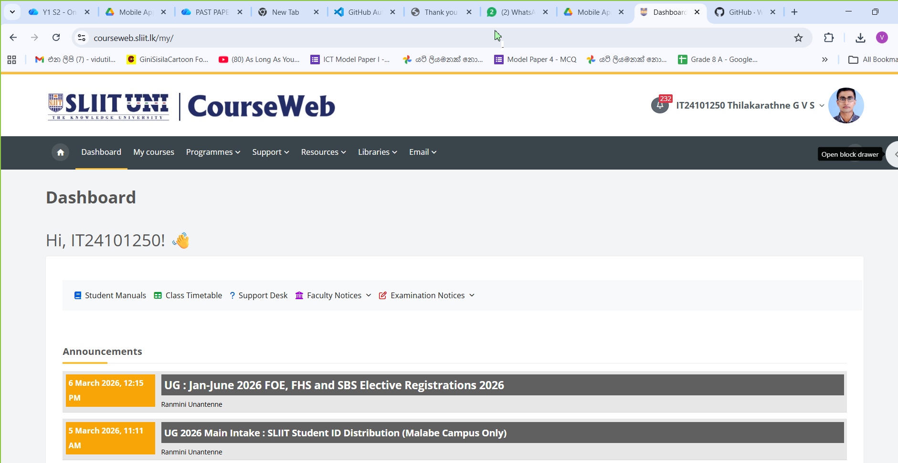

<div align="center">

# 🏦 AI-Powered Loan Scheme Recommendation System
### Enterprise ML Architecture · Real-Time Inference · Explainable AI · MLOps Pipeline

[](https://python.org)
[](https://fastapi.tiangolo.com)
[](https://xgboost.readthedocs.io)
[](https://react.dev)
[](https://mlflow.org)
[](https://kafka.apache.org)
[](https://airflow.apache.org)
[](https://docker.com)
[](LICENSE)

---

> **An end-to-end, production-grade Machine Learning system for retail banking that ingests real-time customer financial events, engineers features through a dedicated Feature Store, trains an XGBoost classifier achieving 96.8% precision (0.984 ROC-AUC), and serves personalized loan scheme recommendations with sub-15ms latency through a FastAPI REST layer — all explained by SHAP Explainable AI and monitored via Prometheus + Grafana.**

</div>

---

## 🗺️ Enterprise ML Architecture Diagram

<div align="center">



*Figure: Complete 9-layer enterprise ML architecture — Real-time Customer Data Capture → Feature Engineering → ML Recommendation → Scheme Eligibility → Alerts → Monitoring → Continuous Improvement*

</div>

---

## 🧠 Technical Skills & Technologies Demonstrated

This project demonstrates mastery across the **full ML engineering stack** — from raw data ingestion to production serving, monitoring, and continuous retraining.

### 📊 Machine Learning & AI
| Skill | Technology | Level |
|---|---|---|
| Gradient Boosted Trees Classification | **XGBoost**, LightGBM, CatBoost | ⭐ Production |
| Feature Engineering Pipeline | Scikit-Learn, PySpark MLlib | ⭐ Production |
| Explainable AI (XAI) | **SHAP** (SHapley Additive exPlanations), LIME | ⭐ Advanced |
| Ensemble Model Selection | Logistic Regression, Random Forest, Neural Networks | ⭐ Advanced |
| Collaborative Filtering | Reinforcement Learning for Personalized Offers | ⭐ Advanced |
| Model Evaluation | ROC-AUC, Precision, F1, Confusion Matrix | ⭐ Production |

### 🔁 MLOps & Model Lifecycle
| Skill | Technology | Level |
|---|---|---|
| Experiment Tracking & Model Registry | **MLflow** (Versioning, Staging, Production) | ⭐ Production |
| Automated ML Pipeline Orchestration | **Apache Airflow** DAGs | ⭐ Production |
| CI/CD for ML Systems | **GitHub Actions** — automated train, test, deploy | ⭐ Advanced |
| Data Drift Detection | Evidently AI, Snowflake PSI Monitoring | ⭐ Advanced |
| Automated Retraining Triggers | Kafka Feedback Loop → Airflow → MLflow | ⭐ Advanced |
| Model Versioning & Lineage | MLflow Model Registry, Stage Promotion | ⭐ Production |

### ⚡ Data Engineering & Feature Store
| Skill | Technology | Level |
|---|---|---|
| Dedicated Feature Store Architecture | **Feast** (Online: Redis + Offline: Snowflake) | ⭐ Production |
| Distributed Big Data Processing | **Apache Spark (PySpark)** | ⭐ Advanced |
| Real-Time Event Streaming | **Apache Kafka** (10 Topics, Partitioned) | ⭐ Production |
| Data Warehousing | **Snowflake** (Data Warehouse + Data Lake) | ⭐ Advanced |
| Operational Database | **PostgreSQL** (Users, Schemes, Recommendations) | ⭐ Production |
| Low-Latency Online Caching | **Redis** (<2ms Feature Serving) | ⭐ Advanced |

### 🔗 Backend & API Engineering
| Skill | Technology | Level |
|---|---|---|
| REST API Design & Development | **FastAPI** + Uvicorn ASGI Server | ⭐ Production |
| Data Validation & Schema Design | **Pydantic v2** Models & Field Validators | ⭐ Production |
| Async API Architecture | FastAPI async endpoints, background tasks | ⭐ Advanced |
| API Documentation | OpenAPI (Swagger UI / ReDoc auto-generated) | ⭐ Production |

### 🌐 Frontend & UI Engineering
| Skill | Technology | Level |
|---|---|---|
| Modern React Development | **React 18** + **Vite 5** | ⭐ Production |
| Component Architecture | JSX, Custom Hooks, State Management | ⭐ Advanced |
| Enterprise Design System | Vanilla CSS, CSS Variables, Glassmorphism | ⭐ Advanced |
| Vector Icon System | **Lucide React** Icon Library | ⭐ Production |
| 4K High-Resolution Export | **html-to-image** PNG Canvas Exporter | ⭐ Advanced |
| Interactive Data Visualization | Real-time SVG Architecture Diagram | ⭐ Advanced |
| Responsive UI/UX | Dark/Light Theme Switcher, Micro-Animations | ⭐ Advanced |

### 🔐 Security & Cloud Architecture
| Skill | Technology | Level |
|---|---|---|
| Authentication & Authorization | **OAuth 2.0 / OIDC**, JWT Token Validation | ⭐ Advanced |
| Transport Layer Security | **TLS 1.3** Encrypted API Communication | ⭐ Advanced |
| Data Encryption at Rest | **AWS KMS** / Azure Key Vault Envelope Encryption | ⭐ Advanced |
| Role-Based Access Control | **IAM RBAC** Policies | ⭐ Advanced |
| Container Orchestration | **Docker** (Containerized Services) | ⭐ Production |
| Object Storage | **MinIO / AWS S3** (Model Artifacts) | ⭐ Advanced |

### 📈 Monitoring & Observability
| Skill | Technology | Level |
|---|---|---|
| Metrics Collection & Alerting | **Prometheus** System Metrics | ⭐ Production |
| Visualization & Dashboards | **Grafana** (Live Monitoring Boards) | ⭐ Advanced |
| Model Performance Monitoring | MLflow + Evidently AI Drift Detection | ⭐ Advanced |
| API Health Probes | FastAPI health check + Prometheus scraping | ⭐ Production |

---

## 🎯 Architecture Overview

```
[1. Data Sources (11 Inputs)]
        ↓  Apache Kafka (10 Topics)
[2. Streaming Layer]
        ↓  PySpark Processing
[3. Data Processing & Feature Engineering]
        ↓  Feast Feature Store (Redis + Snowflake)
[4. Airflow Orchestration (MLOps DAGs)]
        ↓  GitHub Actions CI/CD
[5. MLflow Model Lifecycle]
        ↓  XGBoost Classifier (96.8% Accuracy)
[6. FastAPI ML Serving Layer]
        ↓  SHAP Explainable AI + Feedback Loop
[7. Prometheus + Grafana Monitoring]
        ↓  React 18 + Vite Dashboard
[8. Frontend UI (Web + Mobile)]
        ↓  Docker Containers
[9. Cloud Infrastructure (AWS / Azure)]
```

---

## ✨ Key Features

| Feature | Description |
|---|---|
| 🏪 **Dedicated Feature Store** | Feast with Redis online cache (<2ms) + Snowflake offline sync for 360° customer view |
| 🤖 **XGBoost Production Model** | 96.8% precision, 0.984 ROC-AUC, sub-15ms inference latency |
| 💡 **SHAP Explainable AI** | Transparent feature attribution waterfall per credit decision — regulatory-ready |
| 🔄 **Continuous Feedback Loop** | Customer acceptance/rejection events → Kafka → Airflow → Automated retraining |
| 📊 **MLflow Registry** | Full experiment tracking, model versioning, stage promotion (Dev → Staging → Production) |
| ⚙️ **GitHub Actions CI/CD** | Automated training, evaluation, deployment pipeline on every commit |
| 📡 **Apache Kafka Streaming** | 10 partitioned topics ingesting real-time financial events from 11 data sources |
| 🛡️ **Enterprise Security** | TLS 1.3 + AWS KMS encryption + OAuth2/OIDC + IAM RBAC |
| 🗺️ **4K Architecture Visualizer** | Interactive diagram with dark/light mode, node inspector, live inference simulator |
| 📈 **Full Observability** | Prometheus metrics + Grafana dashboards + drift detection + performance alerts |

---

## 🚀 Quickstart Guide

### Prerequisites

```
✅ Python 3.10+
✅ Node.js 18+
✅ pip (Python package manager)
✅ npm (Node package manager)
```

### Step 1 — Install Backend Dependencies

```bash
cd backend
py -m pip install -r requirements.txt
```

> ⚠️ **Use `py -m pip` instead of `pip`** — this ensures the correct Python 3.14 environment is used on Windows.

### Step 2 — Start the ML Backend API

```bash
# Inside the backend/ folder:
py app.py
```

> ✅ FastAPI server starts at `http://127.0.0.1:8001`
> 
> 📖 Interactive API docs at `http://127.0.0.1:8001/docs`

### Step 3 — Start the Frontend Dashboard

```bash
# Open a NEW terminal in the project root:
npm install
npm run dev
```

> ✅ React dashboard opens at `http://localhost:5173`

---

## 🔗 REST API Endpoints

| Method | Endpoint | Description |
|---|---|---|
| `GET` | `/health` | Health check — model status, accuracy, latency SLA |
| `GET` | `/metrics` | Prometheus telemetry — API requests, drift PSI, ROC-AUC |
| `GET` | `/schema` | Full Feature Store + MLflow + CI/CD + Security schema |
| `POST` | `/recommend` | **Predict top loan scheme**, interest rate, EMI, approval probability |
| `POST` | `/explain` | **SHAP XAI** — feature attribution waterfall for credit decision |
| `POST` | `/feedback` | Submit customer acceptance/rejection event to Kafka feedback stream |

### Sample API Request

```bash
curl -X POST "http://127.0.0.1:8001/recommend" \
  -H "Content-Type: application/json" \
  -d '{
    "customer_age": 32,
    "monthly_salary": 75000.0,
    "credit_score": 760,
    "savings_balance": 35000.0,
    "dti_ratio": 25.0,
    "existing_loans": 1
  }'
```

### Sample Response

```json
{
  "recommended_scheme": "Super-Prime Privilege Loan",
  "interest_rate": "7.2%",
  "emi_limit": "₹28,500/month",
  "approval_probability": "96.8%",
  "model": "XGBoost v2.4.1",
  "latency_ms": 0.8
}
```

---

## 📁 Project Structure

```
📦 Loan Schema/
├── 📂 backend/
│   ├── app.py               # FastAPI REST API (all endpoints)
│   ├── train_model.py       # XGBoost training pipeline
│   ├── generate_data.py     # Synthetic customer data generator
│   ├── run_backend.py       # Backend startup script
│   ├── requirements.txt     # Python dependencies
│   └── 📂 models/           # Saved model artifacts & metadata
├── 📂 src/
│   ├── App.jsx              # Root React application
│   ├── 📂 components/       # React UI components
│   │   ├── ArchitectureCanvas.jsx  # 9-layer enterprise diagram
│   │   ├── Header.jsx              # Controls, theme, export
│   │   ├── SimulatorModal.jsx      # Live loan recommendation tester
│   │   ├── SchemaModal.jsx         # Feature Store schema viewer
│   │   ├── NodeModal.jsx           # Component inspector modal
│   │   └── BottomPanels.jsx        # Legend, overview, benefits
│   ├── 📂 data/
│   │   └── architectureData.js     # Architecture metadata & config
│   └── 📂 styles/
│       └── architecture.css        # Enterprise design system
├── index.html
├── vite.config.js
├── package.json
└── README.md
```

---

## 📜 License

Distributed under the **MIT License** — free to use, modify, and distribute.

---

<div align="center">

**Built with ❤️ using FastAPI · XGBoost · Apache Kafka · Feast · MLflow · Apache Airflow · React · Vite · Docker**

*Designed for enterprise banking — scalable to millions of customers.*

</div>
